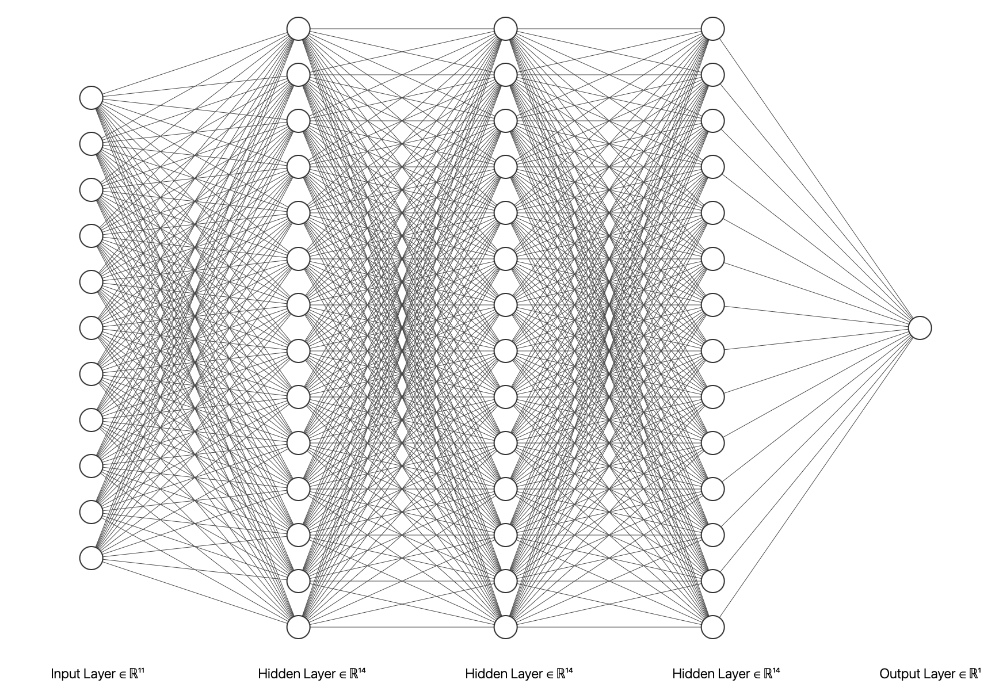
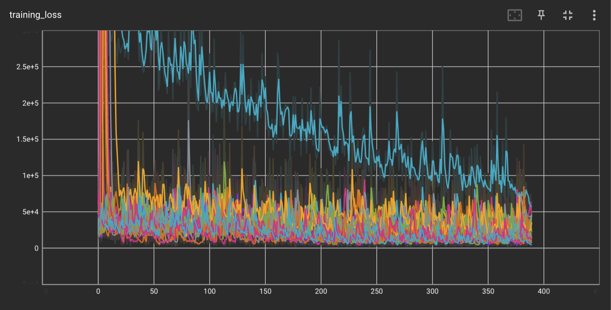
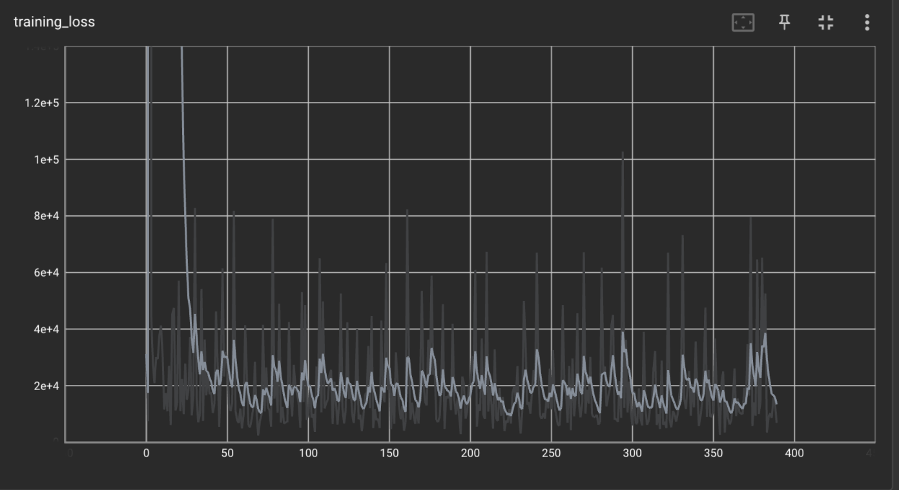
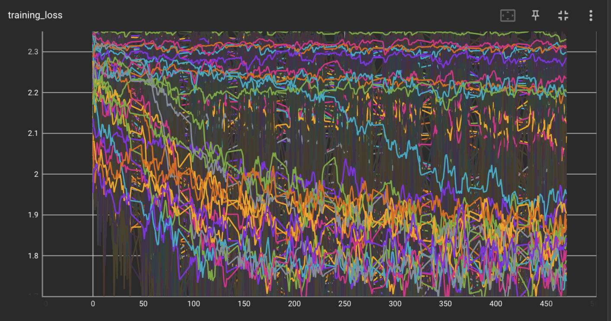

# modelling-airbnbs-property-listing-dataset-
This project is fulfils the data science aspect of the AiCore data career accelerator programme.

The objective of this project was to build a framework to systematically train, tune, and evaluate models on several tasks that are tackled by the Airbnb team.

## Milestone 1
- Two python files were produced, tabular_data.py and prepare_image_data.py to clean and prepare both the tabular data and image data in this project using pandas
- The os context manager package and the PIL package from pillow was used to prepare the image data.


### Cleaning the tabular data
- Data with missing values were dropped form the df, text data was formatted and cleaned and the data.
- The data was returned as tuples (features and labels) to be used by a machine learning model.

```
def remove_rows_with_missing_ratings(df):
    """This method drops all rows with null values included from the rating columns and drops any unnamed columns
    Output: df with rows with null values in rating columns removed and unnamed column removed"""
    df = df.dropna(subset = ["Cleanliness_rating", "Accuracy_rating", "Communication_rating", "Location_rating", "Check-in_rating", "Value_rating"])
    df= df.drop(df.columns[df.columns.str.contains('unnamed', case = False)], axis = 1)
    return df

def combine_description_strings(df):
    """This method completes the following actions to the description column of the data: Removes rows with null values, removes 'About this space' from all rows, strips white spaces, parses the string into a list, removes all empty elements of the list and finally joins the list to be one string
    Output: df with the description data cleaned """
    df.dropna(subset = ['Description'])
    df['Description'] = df['Description'].astype(str)
    df['Description'] = df['Description'].str.replace('About this space', '')
    df['Description'] = df['Description'].str.replace("'", '')
    df['Description'] = df['Description'].apply(lambda x: x.strip())
    df['Description'] = df['Description'].str.split(",")
    df['Description'] = df['Description'].apply(lambda x: [i for i in x if i != ''])
    df['Description'] = df['Description'].apply(lambda x: ''.join(x)).astype(str)

    return df

def set_default_feature_values(df):
    """This function replaces all missing data in the beds, bathrooms, bedrooms and guests columns with the value 1
    Output: df with null columns containing the number 1"""
    df[["beds", "bathrooms", "bedrooms", "guests"]] = df[["beds", "bathrooms", "bedrooms", "guests"]].fillna(1)

    return df

def clean_tabular_data(df):
    """This function calls the methods to clean the data
    Output: cleaned data frame"""
    df = remove_rows_with_missing_ratings(df)
    df = combine_description_strings(df)
    df = set_default_feature_values(df)
    return df
   
def load_airbnb(df, label: str) -> tuple:
    """This function prepares the data to be used in a ML model returning a features and values tuple
    Output:Tuple of features and values of fields with non-text data"""
    df = df.drop(labels = ['ID', 'Category', 'Title', 'Description', 'Amenities', 'Location', 'url'], axis = 1)
    features = df.drop(label, axis = 1)
    labels = df[label]

    return features, labels

```
### Preparing the image data
- Images taken in from the repository and formats all of the images by findings the smallest width of the images and resizes all images to the same height whilst maintaining the images aspect ratio. 
```
def resize_images(base_dir, processed_images_dir):
    """This function opens the image, checks all images are in RGB format and resizes all images in to the same height whilst maintaing the aspect ratio of the image, before saving the image in a processed_images folder.
        base_dir: requires the base directory where all the folders containing the image is stored on the local machine
        processed_images_dir: provides the directory of where the processed photos will be saved"""

    image_file_path_list = []
    smallest_height = float('inf')
    
    for sub_dir in os.listdir(base_dir):
        sub_dir_file_path = os.path.join(base_dir, sub_dir)
        if os.path.isdir(sub_dir_file_path):
            for file in os.listdir(sub_dir_file_path):
                if file.endswith('.jpg') or file.endswith('.png'):
                    with Image.open(os.path.join(sub_dir_file_path, file)) as img:
                        if img.mode == 'RGB':
                            image_file_path_list.append(os.path.join(sub_dir_file_path, file))
                            width, height = img.size
                            if height < smallest_height:
                                smallest_height = height
    print(smallest_height)
                        

    for file in image_file_path_list:
        with Image.open(file) as img:
            width, height = img.size
            aspect_ratio = width / height
            new_width = int(aspect_ratio * smallest_height) 
            resized_img = img.resize((new_width, smallest_height))
            resized_img.save(os.path.join(processed_images_dir, os.path.basename(file)))

```

## Milestone 2
- A regression model was created 
- Several regression algorithms were tests to predict price per night from severall features
- Data was split into train, validation and test sets at a ratio of 70%, 15% and 15% respectively

```
def split_data(X, y):
    """This function splits the data into a train, test and validate samples at a rate of 70%, 15% and 15% resepctively.
    Input: 
        tuples contatining features and labels in numerical form
    Output: 
        3 datasets containing tuples of features and labels from the original dataframe"""
    X_train, X_test, y_train, y_test = train_test_split(X, y, test_size = 0.3)

    print("Number of samples in:")
    print(f"    Training: {len(y_train)}")
    print(f"    Testing: {len(y_test)}")

    X_test, X_validation, y_test, y_validation = train_test_split(X_test, y_test, test_size = 0.5)

    print("Number of samples in:")
    print(f"    Training: {len(y_train)}")
    print(f"    Testing: {len(y_test)}")
    print(f"    Validation: {len(y_validation)}")

    return X_train, y_train, X_test, y_test, X_validation, y_validation 
```

The regression models were then created, the following models were deployed:
- Stochastic Gradient Descent Regressor - Aim to find the best set of model parameters by iteratively adjusting the weights of the parameters to reduce the gradient of the loss function

- Random Forest Regressor - Creates a random ensemble of decision trees, which are not influenced by the previous tree, to predict an outcome. To reduce the error the model aggregates the outputs of all of the trees.

- Decision Tree Regressor - Creates a decision tree model to predict the output by inputting rules to be followed down a tree

- Gradient Boosting Regressor - Creates an ensemble of decision trees which are influenced by the previous tree, each tree works iteratively to reduce the error of the previous tree.


```
def tune_regression_model_hyperparameters(model_class, X_train, y_train, X_test, y_test, X_validation, y_validation, hyperparameters):
    """
    This function takes in a regression model class, training, testing and validation datasets, and a dictionary of hyperparameters to tune. It then uses GridSearchCV to find the best hyperparameters for the model, and returns the best model, the best hyperparameters, and performance metrics (validation and test rmse, r2, and mae).

    Inputs:
        model_class: a regression model class (e.g. RandomForestRegressor)
        X_train: training set of features
        y_train: training set of labels
        X_test: testing set of features
        y_test: testing set of labels
        X_validation: validation set of features
        y_validation: validation set of labels
        hyperparameters: dictionary of hyperparameters to tune
    Outputs:
        best_model: an instance of the model_class, with the best hyperparameters found
        best_hyperparameters: a dictionary of the best hyperparameters found
        performance_metrics: a dictionary of performance metrics (validation and test rmse, r2, and mae)
    """

    performance_metrics = {}
    
    grid_search = GridSearchCV(model_class, hyperparameters, scoring = 'neg_mean_squared_error', cv = 5) 
    grid_search.fit(X_train, y_train)

    best_model = grid_search.best_estimator_
    best_hyperparameters = grid_search.best_params_

    # Provides Validation Metrics
    y_val_pred = best_model.predict(X_validation)
    best_validation_rmse = sqrt(-grid_search.best_score_)
    validation_r2 = r2_score(y_validation, y_val_pred)
    validation_mae = mean_absolute_error(y_validation, y_val_pred)

    # Provides test metrics
    y_test_pred = best_model.predict(X_test)
    test_rmse = sqrt(mean_squared_error(y_test, y_test_pred))
    test_r2 = r2_score(y_test, y_test_pred)
    test_mae = mean_absolute_error(y_test, y_test_pred)

    
    # Map metrics to the performance metrics 
    performance_metrics['validation_rmse'] = best_validation_rmse
    performance_metrics['validation_r2'] = validation_r2
    performance_metrics['validation_mae'] = validation_mae
    performance_metrics['test_rmse'] = test_rmse 
    performance_metrics['test_r2'] = test_r2
    performance_metrics['test_mae'] = test_mae
    
    return best_model, best_hyperparameters, performance_metrics
    
```
 - Each model underwent hyperparameter tuning using gridsearch to find the opitmal hyperparameters of each model. For each model, evaluation metrics were assessed and saved in the repository to be assessed later.
```
    def evaluate_all_models(X_train, y_train, X_test, y_test, X_validation, y_validation): 
    """This function evaluate different regression models by tuning the hyperparameters and then saving the best models, hyperparameters and performance metrics to specific folder.

    Inputs:
        X_train: A numpy array or pandas dataframe, representing the training set for the independent variables.
        y_train: A numpy array or pandas dataframe, representing the training set for the dependent variable.
        X_test: A numpy array or pandas dataframe, representing the testing set for the independent variables.
        y_test: A numpy array or pandas dataframe, representing the testing set for the dependent variable.
        X_validation: A numpy array or pandas dataframe, representing the validation set for the independent variables.
        y_validation: A numpy array or pandas dataframe, representing the validation set for the dependent variable.
    
    Outputs:
        It saves the best models, hyperparameters and performance metrics of all evaluated models to specific folder."""

    sgd_hyperparameters= {
        'penalty': ['l2', 'l1','elasticnet'],
        'alpha': [0.1, 0.01, 0.001, 0.0001],
        'l1_ratio': [0.1, 0.3, 0.5, 0.7, 0.9 ],
        'max_iter': [500, 1000, 1500, 2000],
        'learning_rate': ['constant', 'optimal', 'invscaling', 'adaptive']
    }

    decision_tree_hyperparameters = {
    'max_depth': [10, 20, 50],
    'min_samples_split': [2, 4, 6, 8],
    'min_samples_leaf': [1, 3, 5, 7],
    'splitter': ['best', 'random'] 
    }
    random_forest_hyperparameters = {
        'n_estimators': [50, 100, 150],
        'max_depth': [10,20,50],
        'min_samples_split': [2, 4, 6, 8],
        'min_samples_leaf': [1, 3, 5, 7]

    }
    gradient_boost_hyperparameters = {
        'n_estimators': [50, 100, 150],
        'learning_rate': [0.1, 0.001, 0.0001],
        'criterion': ['friedman_mse', 'squared_error'],
        'min_samples_split': [2, 4, 6, 8],
        'min_samples_leaf': [1, 3, 5, 7]
    }
    model_hyperparameters = [decision_tree_hyperparameters, random_forest_hyperparameters, gradient_boost_hyperparameters]

    models_dict = {
        'SGD Regressor': [SGDRegressor(), sgd_hyperparameters],
        'Decision Tree Regressor': [DecisionTreeRegressor(), decision_tree_hyperparameters],
        'Random Forest Regressor': [RandomForestRegressor(), random_forest_hyperparameters],
        'Gradient Boosting Regressor': [GradientBoostingRegressor(), gradient_boost_hyperparameters]

    }
    
    # Create required directories to save the models to   
    if not os.path.exists('./models'):
        os.makedirs('./models')
    if not os.path.exists('./models/regression'):
        os.makedirs('./models/regression')
    if not os.path.exists('./models/regression/linear_regression'):
        os.makedirs('./models/regression/linear_regression')

    # For loop iterates through the models provided and calls the tune_regression_mode_hyperparameters
    for key, values in models_dict.items(): #TODO - should a random seed be included here?
        model, hyperparameters = values
        best_model, best_hyperparameters, performance_metrics = tune_regression_model_hyperparameters(model, X_train, y_train, X_test, y_test, X_validation, y_validation, hyperparameters)
        folder_path = f'./models/regression/linear_regression/{key}'
        save_model(best_model, best_hyperparameters, performance_metrics, folder_path) 

```

- The evaluation metrics were then assessed to find the model with the greatest accuracy.


## Milestone 3 
- A classification model was created to predict the property category
- The models trained and evaluated included; Logistic Regression, Decision Tree, Gradient Boosting Classifier and Random Forest Classifier.
- To develop this module, several functions were adapted from the linear regression model, the primary changes are with the error measure of the model and the evaluation metrics used, f1_micro was the scoring measure for the grid search conducted.

```
def tune_classification_model_hyperparameters(model_class, X_train, y_train, X_test, y_test, X_validation, y_validation, hyperparameters):
    """
    This function performs hyperparameter tuning for a classification model and returns the best model, its hyperparameters, and its performance metrics on a validation set. 
    
    Parameters:
    model_class (class): A class for a scikit-learn classifier that implements `fit` and `predict` methods.
    X_train (Matrix): Normalized features for training
    y_train (Vector): Lables for training
    X_test (Matrix): Normalized features for testing
    y_test (Vector): Lables for testing
    X_validation (Matrix): Normalized features for validation
    y_validation (Vector): Labels for validation
    hyperparameters (dict): The hyperparameters to be tested by GridSearchCV.
    
    Returns:
    best_model (scikit-learn classifier instance): The best classifier instance after tuning hyperparameters.
    best_hyperparameters (dict): The best hyperparameters obtained from GridSearchCV.
    performance_metrics (dict): A dictionary of performance metrics of the best model on the validation set. The metrics include:
        - validation_accuracy (float): Accuracy score of the model on the validation set.
        - validation_precision (float): Precision score of the model on the validation set.
        - validation_recall (float): Recall score of the model on the validation set.
        - validation_f1_score (float): F1 score of the model on the validation set.
    """
    
    performance_metrics = {}
    
    grid_search = GridSearchCV(model_class, hyperparameters, scoring = 'f1_micro', cv = 5) 
    grid_search.fit(X_train, y_train)

    best_model = grid_search.best_estimator_
    best_hyperparameters = grid_search.best_params_

    # Provides Validation Metrics
    y_validation_pred = best_model.predict(X_validation)
    y_validation_accuracy = accuracy_score(y_validation, y_validation_pred)
    y_validation_precision = precision_score(y_validation, y_validation_pred, average='micro')
    y_validation_recall = recall_score(y_validation, y_validation_pred, average='micro')
    y_validation_f1 = f1_score(y_validation, y_validation_pred, average='micro')

    # Maps metrics to the performance metrics dict
    performance_metrics['validation_accuracy'] = y_validation_accuracy
    performance_metrics['validation_precision'] = y_validation_precision
    performance_metrics['validation_recall'] = y_validation_recall
    performance_metrics['validation_f1_score'] = y_validation_f1

    
    return best_model, best_hyperparameters, performance_metrics
```

## Milestone 4

 - In this milestone, a neural network was created
 - PyTorch was used to create the neural network architecture
 - A custom dataset was created for the airbnb dataset used in this project
 
```
class AirbnbNightlyPriceImageDataset(Dataset):
    def __init__(self, data, prediction_variable):
        super().__init__() 
        self.data = data.drop(data.columns[data.columns.str.contains('unnamed', case = False)], axis = 1)
        self.X, self.y = load_airbnb(self.data, prediction_variable)
        assert len(self.X) == len(self.y) # Data and labels have to be of equal length

    def __getitem__(self, index):
        return (torch.tensor(self.X[index]), torch.tensor(self.y[index]))

    def __len__(self):
        return len(self.X)
```

- The linear regression neural network was created taking in 11 numerical features from the dataset, with price per night the label
- The activation function in the model was the ReLu function
- Dropout was included in the model to prevent the model overfitting
- Model hyperparameters were tuned and the model with the lowest validation error was determined to be the best model

```
class NN(torch.nn.Module):
    def __init__(self, nn_config):
        super().__init__()
        self.hidden_layer_width = nn_config['hidden_layer_width']
        self.dropout = nn_config['dropout']
        
        self.layers = torch.nn.Sequential(
            torch.nn.Linear(11, self.hidden_layer_width), # uses the same width in all layers of the model
            torch.nn.ReLU(),       
            torch.nn.Dropout(self.dropout),
            torch.nn.Linear(self.hidden_layer_width, self.hidden_layer_width),
            torch.nn.ReLU(),
            torch.nn.Dropout(self.dropout),
            torch.nn.Linear(self.hidden_layer_width, 1)

        )

```

- One of the model hyperparameters tested was the hidden layer width, one of the model widths tested was 14 nodes (see below an example)



- Each model with its hyperparameters were trained through the training loop
- Train and validation loss was calculted using mean squared error as the loss function
- Decisions upon the model performance were made on the validation rmse

```
def train_model(train_loader, validation_loader, nn_config, epochs=10):
    """Trains a neural network model on the provided training data and evaluates its performance on the validation data.

    Parameters:
        - train_loader: a PyTorch DataLoader object that loads the training data in batches.
        - validation_loader: a PyTorch DataLoader object that loads the validation data in batches.
        - nn_config: a dictionary containing the configuration for the neural network, including the number of input and output features, the number of hidden layers and their sizes, the activation function to be used, and the type of optimizer and learning rate.
        - epochs: an integer indicating the number of times to loop through the entire dataset during training (default: 10).

    Returns:
        - train_rmse_loss: a float representing the root mean squared error (RMSE) of the model's predictions on the training data.
        - validation_rmse_loss: a float representing the RMSE of the model's predictions on the validation data.
        - train_r2: a float representing the R-squared score of the model's predictions on the training data.
        - validation_r2: a float representing the R-squared score of the model's predictions on the validation data.
        - model_name: a string representing the name of the trained model file."""
    
    model = NN(nn_config)
    writer = SummaryWriter()
    scaler = MinMaxScaler()
    if nn_config['optimiser'] == 'SGD':
        optimiser = torch.optim.SGD
        optimiser = optimiser(model.parameters(), nn_config['learning_rate'])
    if nn_config['optimiser'] == 'Adam':
        optimiser = torch.optim.Adam
        optimiser = optimiser(model.parameters(), nn_config['learning_rate'] )
    batch_index = 0
    train_rmse_loss = 0.0
    validation_rmse_loss = 0.0
    train_r2 = 0.0
    validation_r2 = 0.0

    for epoch in range(epochs): # Loops through the dataset a number of times

        for batch in train_loader: # Samples different batches of the data from the data loader
            
            X_train, y_train = batch # Sets features and labels from the batch

            X_train = X_train.type(torch.float32)
            y_train = y_train.type(torch.float32)
            y_train = y_train.view(-1, 1)

                        
            train_prediction = model(X_train) 
            mse_loss = F.mse_loss(train_prediction, y_train) 
            mse_loss = mse_loss.type(torch.float32)
            mse_loss.backward() # Populates the gradients from the parameters of the smodel
            
            optimiser.step() #Optimisation step
            optimiser.zero_grad() # Resets the grad to zero as the grads are no longer useful as they were calculated when the model had different parameters

            writer.add_scalar('training_loss', mse_loss.item(), batch_index)
            batch_index += 1
            rmse_loss = torch.sqrt(mse_loss)
            train_rmse_loss += rmse_loss.item()            

            train_prediction_detached = train_prediction.detach().numpy()
            y_train_detached = y_train.detach().numpy()
            train_r2 += r2_score(y_train_detached, train_prediction_detached)


        for batch in validation_loader: # Samples different batches of the data from the data loader
            
            X_validation, y_validation = batch # Sets features and labels from the batch
            X_validation = X_validation.type(torch.float32)
            # X_validation_scaled = torch.tensor(scaler.fit_transform(X_validation))
            y_validation = y_validation.type(torch.float32)
            y_validation = y_validation.view(-1, 1)
                        
            validation_prediction = model(X_validation) 
            mse_loss = F.mse_loss(validation_prediction, y_validation) 
            mse_loss = mse_loss.type(torch.float32)
            writer.add_scalar('validation_loss', mse_loss.item(), batch_index) 
            rmse_loss = torch.sqrt(mse_loss)
            validation_rmse_loss += rmse_loss.item()

            #Calculate r2
            validation_prediction_detached = validation_prediction.detach().numpy()
            y_validation_detached = y_validation.detach().numpy()
            validation_r2 += r2_score(y_validation_detached, validation_prediction_detached)
```

- The loss of each model was visualised within tensorboard



- The loss for the best performing model can be seen below




- The model was then tested on the test set to assess the models performance 

## Milestone 5

This milestone reused the neural network code structure to build a multiclass classification neural network to predict the number of bedrooms each property would have. The category data is included in this model as a feature, to include the classification data, the category data is One Hot Encoded to convert the string data into numerical data. The inclusion of the category as an extra featured data added a total of 5 more features once the data had been through OneHotEncoding process.

```
class AirbnbBedroomDataset(Dataset):
    def __init__(self, data, prediction_variable):
        super().__init__() 

        numerical_columns = pd.DataFrame(data.select_dtypes(include=['int64', 'float64']))

        # Label encodes the category column in preparation for 
        le = LabelEncoder()
        data['Category'] = le.fit_transform(data['Category'])

        # fit and transform the category column
        ohe = OneHotEncoder(handle_unknown='ignore')
        category_encoded = pd.DataFrame(ohe.fit_transform(data['Category'].values.reshape(-1,1)).toarray())

        self.X = numerical_columns.join(category_encoded) 
        self.X = self.X.drop(df.columns[df.columns.str.contains('unnamed', case = False)], axis = 1)
        self.X = self.X.drop(columns = [prediction_variable], axis = 1)
        self.X = self.X.values

        # Encodes the labels
        self.y = le.fit_transform(data[f'{prediction_variable}'].values)

        assert len(self.X) == len(self.y) # Data and labels have to be of equal length

    def __getitem__(self, index):
        return (torch.tensor(self.X[index]), torch.tensor(self.y[index]))

    def __len__(self):
        return len(self.X)
```

The changes to the neural network structure include the model predicting 9 outputs (the distinct number of bedroom classes) in which a softmax function was applied to the predictions of the neural network to provide 9 seperate probabilities (all adding up to 1) for each prediction. The class with the highest probability is taken as the prediction. 

```
class NN(torch.nn.Module):
    def __init__(self, nn_config):
        super().__init__()
        #define layers
        self.hidden_layer_width = nn_config['hidden_layer_width']
        self.dropout = nn_config['dropout']
        
        self.layers = torch.nn.Sequential(
            torch.nn.Linear(16, self.hidden_layer_width), # uses the same width in all layers of the model
            torch.nn.ReLU(),       
            torch.nn.Dropout(self.dropout),
            torch.nn.Linear(self.hidden_layer_width, self.hidden_layer_width),
            torch.nn.ReLU(),
            torch.nn.Dropout(self.dropout),
            torch.nn.Linear(self.hidden_layer_width, 9) #Number of unique bedrooms in the labels

        )
        
    def forward(self, X):
        return F.softmax(self.layers(X))
```


The loss function was adapted to cross entropy loss for the multiclass classification model. The training loss for the model was again visualised in tensorboard.




